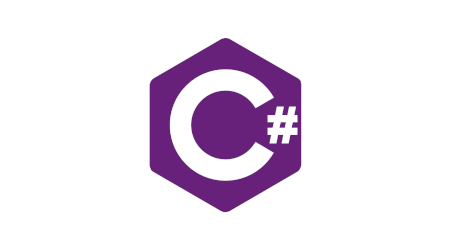

<h1 align="center">Hi! 👋 I'm William!</h1>

- 👀 Searching for opportunities related to Finance and Machine Learning :)
- 🎉 Passionate about ⚽ football, 🏋️‍♂️ gym workouts, and exploring the world 🌍
- 📫 [Connect with me on LinkedIn](https://www.linkedin.com/in/william-eriksson-01691a193/)

  <h3>🛠️ Tools and Frameworks</h3>
   
  
  
  
  
  
  
  
   
  
  
  
  
  

<!---
ErikssonWilliam/ErikssonWilliam is a ✨ special ✨ repository because its `README.md` (this file) appears on your GitHub profile.
You can click the Preview link to take a look at your changes.
--->
